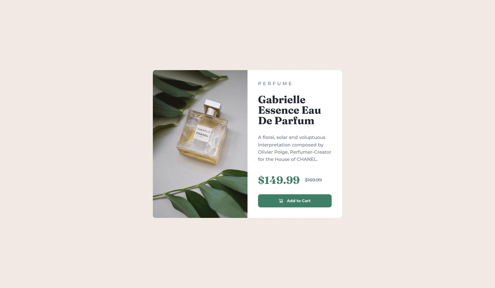

# Frontend Mentor - Product preview card component solution

This is a solution to the [Product preview card component challenge on Frontend Mentor](https://www.frontendmentor.io/challenges/product-preview-card-component-GO7UmttRfa). Frontend Mentor challenges help you improve your coding skills by building realistic projects. 

## Table of contents

- [Overview](#overview)
  - [The challenge](#the-challenge)
  - [Screenshot](#screenshot)
  - [Links](#links)
- [My process](#my-process)
  - [Built with](#built-with)
  - [What I learned](#what-i-learned)
  - [Continued development](#continued-development)
  - [Useful resources](#useful-resources)
- [Author](#author)

## Overview

### The challenge

Users should be able to:

- View the optimal layout depending on their device's screen size
- See hover and focus states for interactive elements

### Screenshot



### Links

- Solution URL: [GitHub](https://github.com/paatre/product-preview-card-component-main)
- Live Site URL: [GitHub Pages](https://paatre.github.io/product-preview-card-component-main)

## My process

### Built with

- Semantic HTML5 markup
- CSS custom properties
- BEM naming convention
- SCSS
- Flexbox
- Mobile-first workflow

### What I learned

There's a lot what I learned. I took my time learning the things I needed for this challenge. Here's some of them:

#### BEM naming convention

This was the first time I tried the BEM naming convention. Also, in the [last challenge](https://github.com/paatre/qr-code-component-main), I decided I'm going to go with SCSS, which I love to use for stylesheets, in all upcoming challenges. I didn't expect how well these two go together! The SCSS file is concise and easy to read. This was something I'm really eager to add to my developer toolbox in later projects.

```html
<main class="product-card">
    <picture class="product-card__image">
      <source media="(max-width: 576px)" srcset="./images/image-product-mobile.jpg">
      <source media="(min-width: 577px)" srcset="./images/image-product-desktop.jpg">
      
    </picture>
    <div class="product-card__info">
      <p class="product-card__category">Perfume</p>
      <h1 class="product-card__name">Gabrielle Essence Eau De Parfum</h1>
      <p class="product-card__description">A floral, solar and voluptuous interpretation composed by Olivier Polge, Perfumer-Creator for the House of CHANEL.</p>
      <div class="product-card__price-group">
        <strong class="product-card__discounted-price">$149.99</strong>
        <s class="product-card__original-price">$169.99</s>
      </div>
      <button class="product-card__button" type="button">Add to Cart</button>
    </div>
  </main>
```
```scss
.product-card {
    ...

    &__image {
      ...
    }

    &__info {
      ...
    }

    &__category {
      ...
    }

    &__name {
      ...
    }

    &__description {
      ...
    }

    &__price-group {
      ...
    }

    &__discounted-price {
      ...
    }

    &__original-price {
      ...
    }

    &__button {
      ...
    }
```

#### How to make responsive images

First I learned about `img` tag's `srcset` attribute. Then I understood it's not going to work in this project which is when I found the `picture` tag. It was the answer to my needs so I used it with choosing different images to desktop and mobile. I did have some problems with the `img` inside `picture`, though. The `picture` element had bigger height than the `img` element and for some time I didn't know how to solve the problem. Until I found the answer from Stack Overflow: [https://stackoverflow.com/questions/66087045/picture-element-has-bigger-height-than-the-img](https://stackoverflow.com/questions/66087045/picture-element-has-bigger-height-than-the-img)

> Because as an inline-element, the image is vertically aligned at the baseline, which leaves some space below it. Just add `display: block` to the image to avoid that.

Need to remember this in the future! That said, setting `vertical-align` to `middle` works also. If I need an inline `img` element that I can't transform as a block element, the first solution doesn't work. But in this project it did!

This was something I also learned about `source` element:

> Required if the `source` element's parent is a <picture> element, but not allowed if the `source` element's parent is an `audio` or `video` element.

How about that!

### Continued development

I noticed nesting blocks with BEM and SCSS is an area which may have a better way of doing it than what I did. I found resources that helped me forward with it but I need to check if there's more advanced syntaxes for it.

Horizontal responsive design is something that usually gets a lot of notice but I want to be better with vertical responsiveness.

### Useful resources

- [BEM and SASS: A Perfect Match](https://andrew-barnes.medium.com/bem-and-sass-a-perfect-match-5e48d9bc3894) - The resource that made me realize the possibilities with BEM and SCSS.
- [BEM CSS Tip: Dealing with grandchild elements](https://andrew-barnes.medium.com/bem-css-tip-dealing-with-grandchild-elements-d7378b51e722) - Helped me with nesting BEM elements.
- [MDN: Responsive images](https://developer.mozilla.org/en-US/docs/Learn/HTML/Multimedia_and_embedding/Responsive_images) - The definitive information I needed to make responsive images work in this project. A great help!

## Author

- GitHub - [@paatre](https://github.com/paatre/)
- Frontend Mentor - [@paatre](https://www.frontendmentor.io/profile/paatre)
- Twitter - [@teemuviikeri](https://twitter.com/TeemuViikeri)
